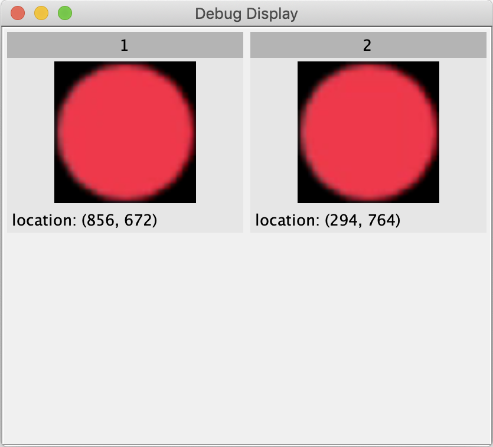
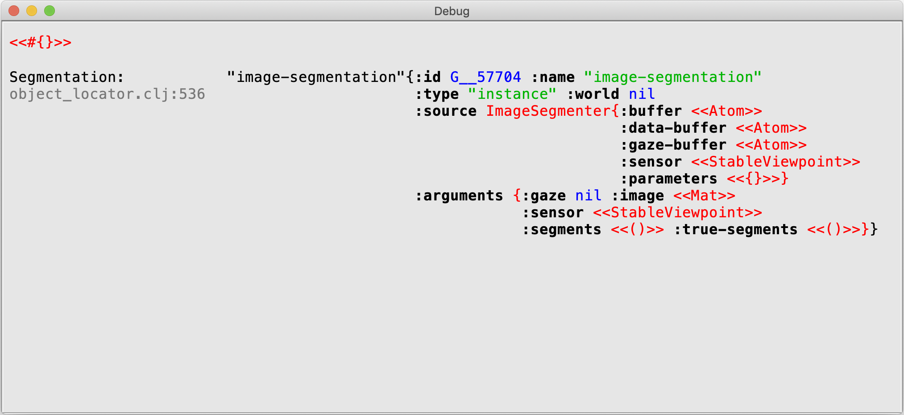
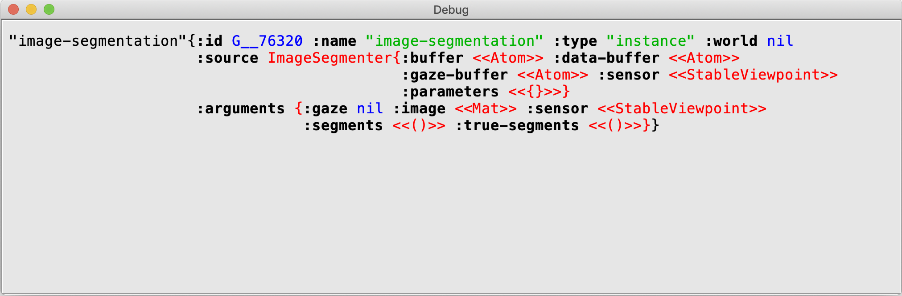

Display
===

The display is a component that can show information about ARCADIA's internal state. It can replace the functionality of various display components that have been used in the past (object display, fixation display, etc). It includes features to support building demos (e.g., customizing the appearance of text and images in your display), as well as features to support debugging (e.g., interactive browsing through Clojure data structures). To learn more, check out the overview below. Then, you can read through the tutorial and inspect the reference section as needed.

To see all of the display's parameters and their default values, check out arcadia.component.display in the source code.

- [Overview](#overview)
- [Tutorial](#tutorial)
    - [Elements](#elements)
    - [Information Functions](#information-functions)
    - [Images](#images)
    - [Panels](#panels)
    - [Glyphs](#glyphs)
    - [Alternatives to Information Functions](#alternatives-to-information-functions)
    - [Preconfigured Display Setups](#preconfigured-display-setups)
    - [Browsing through Data](#browsing-through-data)
    - [Debugging at Runtime](#debugging-at-runtime)
    - [Multiple Instances](#multiple-instances)
- [Reference](#reference)
    - [Information Function Keywords](#information-function-keywords)
    - [Parameters for Specifying Information](#parameters-for-specifying-information)
    - [Parameters for Specifying Panel Size](#parameters-for-specifying-panel-size)
    - [Parameters for Formatting Text](#parameters-for-formatting-text)
    - [Parameters for Formatting Images](#parameters-for-formatting-images)
    - [Parameters for Formatting Glyphs](#parameters-for-formatting-glyphs)

## Overview

Debug displays are organized through the use of three key concepts: elements, panels, and glyphs.

<br>


Elements are images or text items that describe some information about ARCADIA's state. For example, an image element might depict the latest visual input, or show what a visual segment looks like. A text element might describe the number of objects in VSTM, the last-known location of a particular object, or the name of the current task being performed. Some text elements even include dropdowns that can allow a single element to be, for example, an exapandable list of everything currently in accessible content. Elements can optionally include captions, which are displayed to the left of the element. In the above example, the first element, which describes the time, has no caption, whereas the four elements below it do have captions.

<br>


Panels are rectangular regions in which elements are displayed. Some displays use only a single panel, whereas others have multiple panels organized in a (`cols` x `rows`) two-dimensional grid. Within a panel, elements are organized in a column, one above the next. Panels can optionally include headers, which are displayed above the panel. In the example above, there are two panels, each containing elements that describe an object in VSTM. In contrast, in the first example there is a single panel which occupies the entire display.

<br>


Glyphs are images, shapes, or text strings that are drawn onto image elements at specified locations. Consider the example above. Here there is a single element, a black rectangle, onto which glyphs have been drawn. These includes images showing each segment in the visual input, rectangles around each tracked object's last-known location, and text strings describing each tracked object's slot number in VSTM.

## Tutorial

This tutorial will explain how to configure the display, beginning with simple examples and gradually adding complexity. You will learn about information functions, which extract information about ARCADIA's state, as well as panels, elements, and glyphs, which organize the information in the display. If you plan to use only simple displays, you may not care much about panels and glyphs. However, I recommend at least skimming every section, as later sections build on earlier ones.

If you want to browse through data structures while debugging code, check out [Browsing through Data](#browsing-through-data) and [Debugging at Runtime](#debugging-at-runtime). If you want to use displays that are preconfigured to show useful information (such as the time, cycle number, and current focus), check out [Preconfigured Display Setups](#preconfigured-display-setups). If you want to use multiple displays for depicting different information, check out [Multiple Instances](#multiple-instances).

### Elements


```Clojure
(model/add
 display
 {:x 50 :y 50
  :panel-width 300
  :caption-width 80
  :elements
  [["Tracking Targets"]
   ["Focus" "Fixation"]
   ["Seg Count" 8]]})
```

Here is a very simple display setup. We specify the display's location on the screen (`:x` `:y`), its width (`:panel-width`), and the width of each caption (`:caption-width`). Finally, we provide a list of three elements. Elements are the things that will be displayed--as you can see, they are organized vertically in the display window. Each element is specified in a vector containing [optional-caption element]. In this example, ["Tracking Targets"] indicates an element with no caption (because there's only a single item in the vector), so it appears left-aligned in the displayed. In contrast, ["Seg Count" 8] indicates that there is a caption "Seg Count" and an element 8. In the display, the caption appears to the left of the element.

<br><br>


```Clojure
(model/add
 display
 {:x 50 :y 50
  :panel-width 300
  :caption-width 80
  :elements
  [["Tracking Targets"
    :center? true :bold? true]                ;;
   ["Focus" "Fixation"
    :italic? true :caption-italic? false]     ;;
   ["Seg Count" 8]]})
```

In this example, and all the examples to follow, we will use `;;` to indicate something new in the code.

Here, we see that elements can be more complex. The full element specification is [optional-caption element optional-param-name optional-param-value ...]. There can be any number of parameters specified for an element. These parameters will override the component's parameters only when displaying that particular element. In this case, `:center?` is `true` only for the first element, so that element will be displayed centered. Similarly, that element will be displayed bold. The second element will be displayed in italic.

Of course, thus far the examples are rather boring: they don't convey any information about what the ARCADIA model is doing. To convey information, we will need to use information functions.

<br><br>

### Information Functions


```Clojure
(model/add
 display
 {:x 50 :y 50
  :panel-width 300
  :caption-width 80
  :elements
  [["Tracking Targets"
    :center? true :bold? true]
   ["Focus" (i# (-> % :focus :name))                  ;;
    :italic? true :caption-italic? false]
   ["Seg Count"
    (i# (-> % :content                                ;;
            (first-element :name "image-segmentation");;
            :arguments :segments count))]]})          ;;
```

Information functions are specified using the `i#` macro, defined in `arcadia.utility.display`. The `i#` macro defines an anonymous function that takes a single argument: a hash map describing ARCADIA's state. This hash map looks like `{:focus focus :content content}`, so the function can access both the current focus of attention and the current accessible content. On each cycle, the information function is called on the hash map, and the resulting information is displayed. Let's consider the two examples here (note that both examples use the threading macro `->`).
```Clojure
(i# (-> % :focus :name))
```
The `i#` macro replaces `%` with the function input, so on each cycle, the element to be displayed will be `(-> {:focus focus :content content} :focus :name)`. In other words, the name of the focus will be displayed.
```Clojure
(i# (-> % :content (first-element :name "image-segmentation") :arguments :segments count))
```
This example uses `first-element`, a helpful descriptor macro, to find the first element in accessible content whose name is `"image-segmentation"`. It then returns the count of the segments.

The input to information functions actually contains more than just :focus and :content. As we proceed through the tutorial, we will discuss other keys that information functions can use.

<br><br>


```Clojure
(model/add
 display
 {:x 50 :y 50
  :panel-width 300
  :caption-width 80
  :elements
  [["Tracking Targets"
    :center? true :bold? true]
   ["Focus" (i# (-> % :focus :name))
    :italic? (i# (-> % :focus :name (= "fixation")))   ;;
    :caption-italic? false]
   ["Seg Count"
    (i# (-> % :content
            (first-element :name "image-segmentation")
            :arguments :segments count))]]})
```

In addition to using information functions to extract elements, we can use them to set parameter values. In this example, the second element's `:italic?` parameter is set to `(i# (-> % :focus :name (= "fixation"))`. In other words, on each cycle the name of the focus will be displayed in italic only if it is equal to `"fixation"`.

<br><br>

### Images


```Clojure
(model/add
 display
 {:x 50 :y 50
  :panel-width 300
  :caption-width 80
  :sensor (get-sensor :stable-viewpoint)                  ;;
  :elements
  [["Tracking Targets"
    :center? true :bold? true]
   ["Focus" (i# (-> % :focus :name))
    :italic? true :caption-italic? false]
   [(i# (-> % :focus :arguments :image))              ;;
    :element-type :image :image-width 80 :image-height 80];;
   [(i# (-> % :image))                                    ;;
    :element-type :image :image-scale 0.25]]})            ;;
```

Displays can show images, as well as text. There are a few important things to note in this example (again, highlighted with `;;` in the code).

We set the component's `:sensor` parameter so that the component has access to the visual input. Because we have done this, we unlock a new key for information functions: `:image`. Just as `:focus` and `:content` provide access to ARCADIA's current focus and content, `:image` provides access to ARCADIA's current visual input.

(Note: In visual models, ARCADIA's state is largely derived from the visual input, but only after a few cycles of processing. Therefore, ARCADIA's current state will tend to correspond to the visual input from a couple cycles earlier. To address this issue, the display introduces a delay between the cycle when visual input is produced and the cycle when that input is available via the `:image` key. This delay is controllable via the `:sensor-delay` parameter. The default value is 1, meaning `:image` will provide the visual input from one cycle earlier.)

We have two new elements in this example, both of them images. When an element is an image, it is important to do two things:
1. set `:element-type` to `:image` (the default `:element-type` is `:text`); and
1. specify the image dimensions for display, either with (`:image-width` `:image-height`) or with `:image-scale`. In this case, the first image, the `:image` of the current focus, will be displayed with dimensions (80 80). The second image, the visual input, will be displayed at scale 0.25, meaning one quarter the size of the visual input.

<br><br>


```Clojure
(model/add
 display
 {:x 50 :y 50
  :panel-width 300
  :panel-height 300                                      ;;      
  :caption-width 80
  :flatten-elements? true                                    ;;
  :elements
  [["Object"                                                 ;;
    (i# (-> % :content                                       ;;
            (filter-elements :name "object" :world "vstm"))) ;;
    :element-value (i# (-> % :element :arguments :image));;
    :element-type :image :image-width 80 :image-height 80]]});;
```

Sometimes, it can be cumbersome or impossible to type out each individual element that will be displayed. In such cases, we can instead have an element's information function return a list of items and set the parameter `:flatten-elements?` to `true`. For example, here the element's information function returns a list of all the objects in vstm. Because `:flatten-elements?` is `true`, these objects will be displayed as distinct elements. In the figure, we see that there are currently two objects in vstm. Each is displayed separately, with its own `"Object"` caption.

In this example, we don't want to display the entire interlingua element describing each object. Rather, we want to display each object's `:image` argument (the image showing what the object looks like). To do this, we use the `:element-value` parameter to specify an information function that will be called separately for each item in the list. We can see that this information function uses a new key, `:element`, which refers to the current element, in this case the vstm object. When `:element-value` is provided, it indicates that we want to display whatever it specifies, rather than displaying the element as a whole.

As a reminder, we've now discussed four keys that can be used by information functions: `:focus`, `:content`, `:image` (the visual input, available only when a `:sensor` is provided), and `:element` (the current element). So now we can think of the information function's input as being `{:focus focus :content content :image image :element element)`.

Lastly, one important note: in all the previous examples, the component was able to determine the height of the display automatically, based on the elements to be displayed. In this example, that isn't possible. Because `:flatten-elements?` is `true`, the number of elements to display will vary depending on the number of objects in vstm. Therefore, we must specify the height of the display directly, using the `:panel-height` parameter.

<br><br>


```Clojure
(model/add
 display
 {:x 50 :y 50
  :panel-width 300
  :panel-height 300
  :caption-width 80
  :flatten-elements? true
  :elements
  [[(i# (-> % :element :arguments :slot))                  ;;
    (i# (-> % :content
            (filter-elements :name "object" :world "vstm")))
    :element-value (i# (-> % :element :arguments :image))
    :element-type :image :image-width 80 :image-height 80]]})
```

In the previous example, both vstm objects were displayed with the same caption, which wasn't very interesting. Fortunately, captions can also be specified with information functions, and if the information function uses the `:element` key, it can provide a different value for each element in a list. Here, the caption for each element is that element's slot number.

<br><br>

### Panels


```Clojure
(model/add
 display
 {:x 50 :y 50
  :rows 2 :cols 2
  :center? true          
  :flatten-panels? true
  :element-type :image :image-width 120 :image-height 120
  :panels
  [["Object"
    (i# (-> % :content
            (filter-elements :name "object" :world "vstm")))]]
  :elements
  [[(i# (-> % :panel :arguments :image))]]})
```

Up until now, you may have wondered why the display width and height are specified with the parameters `:panel-width` and `:panel-height`. The reason is that element's are actually displayed inside panels. A display window can include multiple panels, laid out in a two-dimensional grid with dimensions specified by the parameters (`:cols` `:rows`). Each panel has an optional header (just as elements have optional captions), and below the header can be one or more elements.

In all our previous examples, we didn't have to worry about panels because all the elements were in a single panel. But consider this example. Here, we have a 2x2 grid of panels (`:rows` and `:cols` are both 2). The panels are specified by the `:panels` parameter, which works much like the `:elements` parameter. We have a list of vectors of the form [optional-header panel optional-param-key optional-param-value...]. In this case, there is only one item listed under the `:panels` parameter. However, because this item's information function returns the list of objects in vstm and `:flatten-panels?` is `true`, the component will display a separate panel for each object in vstm.

Although each panel corresponds to an object in vstm, the display does not show panels directly: it only displays their headers and the elements within them, so we must specify the elements to appear within each panel. We do so using a new information-function key, `:panel`, which allows an element to be related to its panel's value. Here, the element to be displayed is each panel's (in this case, each vstm object's) `:image` argument. The end result is a display similar to the previous one, but with the images organized in a grid instead of a single column.

<br><br>


```Clojure
(model/add
 display
 {:x 50 :y 50
  :center? true
  :flatten-panels? true
  :rows 2 :cols 2
  :element-type :image :image-width 120 :image-height 120
  :header-color java.awt.Color/red                          ;;
  :header-background java.awt.Color/green                   ;;
  :panels
  [[(i# (-> % :panel :arguments :slot))                 ;;
    (i# (-> % :content
            (filter-elements :name "object" :world "vstm")))]]
  :elements
  [[(i# (-> % :panel :arguments :image))]]})
```

Just as we wanted distinct captions for each element in the older example, here we might want distinct headers for each panel. We can do so in the same way, by specifying an information function that returns the panel's slot argument.

Just for fun, we've also added some color in this version. The `:header-color` parameter specifies the text color of the headers, whereas the `:header-background` specifies the background color. Note that colors always need to be `java.awt.Color` objects.


<br><br>


```Clojure
(model/add
 display
 {:x 50 :y 50
  :center? true
  :flatten-panels? true
  :rows 2 :cols 2
  :element-type :image :image-width 120 :image-height 120
  :panel-width 200
  :panels
  [[(i# (-> % :panel :arguments :slot))
    (i# (-> % :content
            (filter-elements :name "object" :world "vstm")))]]
  :elements
  [[(i# (-> % :panel :arguments :image))]
   ["location" (i# (-> % :panel :arguments :region reg/center));;
    :element-type :text :center? false]]})                     ;;
```


Panels may contain more than one element. In this example, we've added a second element: each vstm object's location. We've used the information function:
`(i# (-> % :panel :arguments :region reg/center))`, which extracts each panel's (in this case, each vstm object's) region and calls the regions function `center` to get a point representing the center of the object's location.

Note that 2D points are displayed in the form `(x, y)`, by default. If you want to display points in their original form, set the parameter `:pretty-points?` to `false`.

We need to specify that this new element's type is `:text` because the overall element type for this component is `:image`.

<br><br>



```Clojure
(model/add
 display
 {:x 50 :y 50
  :center? true
  :flatten-panels? true
  :rows 2 :cols 2
  :element-type :image :image-width 120 :image-height 120
  :panel-width 200
  :sensor (get-sensor :stable-viewpoint)
  :panels
  [[(i# (-> % :panel :arguments :slot))
    (i# (-> % :content
            (filter-elements :name "object" :world "vstm")))]]
  :elements
  [[(i# (-> % :panel :arguments :image))]
   ["location" (i# (-> % :panel :arguments :region reg/center))
    :element-type :text :center? false :precision 0]]})        ;;
```

One minor issue with the previous example is that the locations are displayed with a 0 after the decimal point. This looks slightly ugly, so we can get rid of it by specifying that `:precision` is 0. The `:precision` parameter indicates the max number of digits after the decimal point whenever a number is displayed.

<br><br>

### Glyphs


```Clojure
(model/add
 display
 {:x 50 :y 50
  :element-type :image :center? true
  :image-scale 0.5
  :sensor (get-sensor :stable-viewpoint)
  :elements
  [[java.awt.Color/black]]
  :glyphs
  [[(i# (-> % :content
            (filter-elements :name "object-location")))
    :glyph-value (i# (-> % :glyph :arguments :region))
    :color java.awt.Color/green]]})
```

In addition to specifying a list of panels and a list of elements, we can specify a list of glyphs. Glyphs are annotations that will be drawn on top of image elements before displaying them.

Consider this example. We have just a single element, whose value is a color, `java.awt.Color/black`. When an element is a color and the `:element-type` is `:image`, the element is displayed as a rectangle with the specified color. Because `:image-scale` is 0.5, the rectangle is half the size of the visual input.

We've specified one glyph, which will be drawn onto a black image. Glyphs are specified with the vector [glyph optional-param-name optional-param-value ...]. Here, the glyph is specified with an information function that returns the list of `object-locations` from accessible content. Note that unlike panels and elements, glyphs are always flattened: each item in the list of `object-locations` will be drawn as a distinct glyph.

Earlier, we saw an example of using `:element-value` to specify what part of an element should be displayed. Similarly, here we use `:glyph-value` to specify what part of the glyph should be displayed. In this case, we want to display a rectangle representing each object-location's region. The information function uses the `:glyph` key, which refers to the current glyph (in this case, the `object-location`).

Finally, we specify that the rectangles should be green in color.

<br><br>


```Clojure
(model/add
 display
 {:x 50 :y 50
  :element-type :image :center? true
  :image-scale 0.5
  :sensor (get-sensor :stable-viewpoint)
  :elements
  [[java.awt.Color/black]]
  :glyphs
  [[(i# (-> % :content                                    ;;
            (first-element :name "image-segmentation")    ;;
            :arguments :segments))                        ;;
   :glyph-value (i# (-> % :glyph :image))             ;;
   :glyph-region (i# (-> % :glyph :region))               ;;
   :glyph-mask (i# (-> % :glyph :mask))]           ;;
   [(i# (-> % :content
              (filter-elements :name "object-location")))
     :glyph-value (i# (-> % :glyph :arguments :region))
     :color java.awt.Color/green]]})
```

Remember those segments we were counting back in the Information Functions section? Let's draw those segments directly onto the image, so that we can see what they look like and where they are located. For this example, our glyph's information function returns the list of segments in the `image-segmentation`. We use `:glyph-value` to specify what will be displayed (each segment's `:image` field). We use `:glyph-region` to specify where each image will be displayed (within each segment's region). Finally, we use `:glyph-mask` to provide an alpha mask indicating what parts of each image to copy over (this is optional).

<br><br>


```Clojure
(model/add
 display
 {:x 50 :y 50
  :element-type :image :center? true
  :image-scale 0.5
  :sensor (get-sensor :stable-viewpoint)
  :elements
  [[java.awt.Color/black]]
  :glyphs
  [[(i# (-> % :content
            (first-element :name "image-segmentation")
            :arguments :segments))
    :glyph-value (i# (-> % :glyph :image))
    :glyph-region (i# (-> % :glyph :region))      
    :glyph-mask (i# (-> % :glyph :mask))]          
   [(i# (-> % :content
            (filter-elements :name "object-location")))
    :glyph-value (i# (-> % :glyph :arguments :region))
    :color java.awt.Color/green]
   [(i# (-> % :content                                          ;;
            (filter-elements :name "object-location")))         ;;
    :glyph-value (i# (-> % :glyph :arguments :slot))            ;;
    :glyph-region (i# (-> % :glyph :arguments :region))         ;;
    :y-offset -10                                               ;;
    :color java.awt.Color/green]]})                             ;;
```

So far, we've seen two types of glyphs: rectangles and images. The display also supports a third type: text, which can be written directly onto the image. In this example, the text is the slot number for each `object-location`.

As in the previous example, we use `:glyph-value` to specify what is to be displayed, and `:glyph-region` to specify where it should be displayed. In addition, we use `:y-offset` to specify that the glyph should actually be displayed 10 pixels above this location. Thus, we can display the text above the rectangles.

<br><br>

## Alternatives to Information Functions


```Clojure
(model/add
 display
 {:x 50 :y 50
  :panel-width 300
  :elements
  [["Red Count"
    (remember-previous
     (i# (if (-> % :focus
                 (element-matches? :name "object" :color "red"))
           (inc (:previous %))
           (:previous %)))
     0)]]})
```

Thus far, our examples have relied heavily on information functions to specify elements, panels, glyphs, and some parameter values. However, there are variants and alternatives that can be used in the place of information functions. Like `i#`, these are defined in `arcadia.utility.display`.

The first example is `remember-previous`, a function that wraps around an information function and indicates that the function should save the value it returns on each cycle and make that value available on the following cycle via the `:previous` key. `remember-previous` takes two arguments: the information function and an initial value, which is what `:previous` will be set to on the first cycle.

In this example, the information function counts the number of times that the focus of attention is a red object. On each cycle, it checks whether the current focus is a red object. If it is, then the information function increments the number currently stored in `:previous` and returns the result. If not, then the information function simply returns the number currently stored in `:previous`.

<br><br>


```Clojure
(model/add
 display
 {:x 50 :y 50
  :panel-width 300
  :elements
  [["Red Count"
    (remember-previous
     (i# (if (-> % :focus
                 (element-matches? :name "object" :color "red"))
           (inc (:previous %))
           (:previous %)))
     0)]
   [(progression                                            ;;
     "Beginning model."                                     ;;
     [[(i# (-> % :focus (element-matches? :name "object"))) ;;
       "Object found."]                                     ;;
      [(i# (-> % :focus                                     ;;
               (element-matches? :name "action")))          ;;
       "Action has been taken."]])]]})                      ;;
```

The `progression` function takes two arguments: an initial value, and a list of [check-fn value] vectors. It resolves to the initial value at first. On each cycle, if the first `check-fn` returns true then the corresponding value will be used. That value will continue to be used until the second `check-fn` returns true, at which point that value will be used, and so on.

In this example, the display will show "Beginning model." initially. When the first information function returns true, meaning the current focus of attention is an object, then the display will progress to showing "Object found." It will continue to do so until the second information function returns true, meaning the current focus of attention is an action. Then, it will display "Action has been taken." Because nothing else remains in the progression, it will continue showing this last statement for as long as the model runs.

<br><br>


```Clojure
(model/add
 display
 {:x 50 :y 50
  :panel-width 300
  :color                                                        ;;
  (nth-value                                                    ;;
   [java.awt.Color/red java.awt.Color/green java.awt.Color/blue ;;
    java.awt.Color/yellow java.awt.Color/orange                 ;;
    java.awt.Color/magenta java.awt.Color/cyan]                 ;;
   (i# (:cycle %))                                              ;;
   java.awt.Color/black)                                        ;;
  :elements
  [["Red Count"
    (remember-previous
     (i# (if (-> % :focus
                 (element-matches? :name "object" :color "red"))
           (inc (:previous %))
           (:previous %)))
     0)]
   [(progression
     "Beginning model."
     [[(i# (-> % :focus (element-matches? :name "object")))
       "Object found."]
      [(i# (-> % :focus (element-matches? :name "action")))
       "Action has been taken."]])]]})
```

The `nth-value` function takes three arguments: a list of items, an index (typically an information function that resolves to some index value), and an optional default item. On each cycle, it uses the index to pick an item from the list. If the index is outside the bounds of the list, or if the index is not a number, the default item is used.

Here, we have a list of possible colors to use when displaying text. The index is an information function that returns the current cycle number. This number is used as an index to select a color. Thus, the display will use the color red on the first cycle, the color green on the second cycle, etc. When the cycle number progresses beyond the number of items in the list, the display will use the color black.

This example shows us one more key that information functions can use, `:cycle`, the current cycle number.


<br><br>


```Clojure
(model/add
 display
 {:x 50 :y 50
  :center? true
  :flatten-panels? true
  :header-background
  (map-to-panels
   [java.awt.Color/red java.awt.Color/green
    java.awt.Color/blue java.awt.Color/yellow])
  :rows 2 :cols 2
  :element-type :image :image-width 120 :image-height 120
  :panels
  [[" "
    (i# (-> % :content
            (filter-elements :name "object" :world "vstm")))]]
  :elements
  [[(i# (-> % :panel :arguments :image))]]})
```

The examples so far from this section can be used to specify panels/elements/glyphs, headers/captions, or parameter values. We conclude with `map-to-panels`, which can be used only for parameter values. When `:flatten-panels?` is `true` and there is a list of panels, `map-to-panels` can specify a list of parameter values that will map across the list of panels. In this example, the first panel will have a red header background, the second will have a green header background, etc.

The `map-to-panels` function takes the list of values and an optional second argument: a default value. If a default value is provided, then any panels that exceed the list of parameter values will take this final value. If no final value is provided, then the list will cycle. For example, in this case, if there were a fifth panel then its header background would be red again.

Along with `map-to-panels`, there are `map-to-elements` and `map-to-glyphs` functions. These functions are useful for color-coding corresponding items across displays. For example, one display could show vstm objects as in this example, whereas another could show object locations via glyphs, and each corresponding pair could use the same colors.

<br><br>

### Preconfigured Display Setups


```Clojure
(model/add
 display.status ;;
 {:x 50 :y 50
  :elements
  [["Red Fixes"
    (remember-previous
     (i# (if (-> % :focus (element-matches? :name "object" :color "red"))
           (inc (:previous %))
           (:previous %)))
     0)]]})
```

Configuring the display from scratch can be a lot of work, and it is wasteful since users often will want to display the same elements of information. Therefore, there are several prebuilt parameter configurations listed in `arcadia.component.parameter-configurations`. To use these, simply `model/add` the configuration's name, instead of adding `display`.

In this first example, we `model/add` the `display.status`, which is configured to display several useful items of information in a single panel: the current time, the cycle number, the focus, and the source from which the focus came. If the user specifies any `:elements`, these will appear in the display after those four things. The user also can overwrite any parameter value from the configuration, as needed.

(It may seem strange that four elements are being displayed, when the `:elements` parameter specifies only one. This happens because `display.status` uses the `:initial-elements` parameter, which can be used to specify elements that should appear before those specified in `:elements`.)

In this example, we are adding one element, which counts the number of times the focus of attention is a red object.


<br><br>


```Clojure
(model/add
 display.objects
 {:x 50 :y 50
  :elements
  [["area"
    (i# (-> % :panel :arguments :area))]]})
```

Here we are using `display.objects`, which is preconfigured to display the initial and latest location of each object in vstm. Because there is a panel for each object, we can add elements which will be displayed for all of the objects. Here, we are indicating that each object's area should be displayed.

<br><br>


```Clojure
(model/add
 display.objects
 {:x 50 :y 50
  :panels                                                            ;;
  [[(i# (-> % :content                                                   ;;
            (filter-elements :name "object" :world "working-memory")))]] ;;
  :elements
  [["area"
    (i# (-> % :panel :arguments :area))]]})
```

If we want, we can overwrite the `display.objects`'s `:panels` parameter, so that it displays the same elements, but for something different from vstm objects. In this case, we've configured the component to display information about objects in working-memory, instead of vstm.

<br><br>


```Clojure
(model/add
 display.scratchpad
 {:x 1500 :y 20
  :sensor (get-sensor :stable-viewpoint)
  :elements [["Focus" (i# (:focus %))]]})
```

Finally, the `display.scratchpad` is configured to support interactive browsing through data. By default, it shows all of accessible content in a collapsed form; click on that red first line to expand accessible content and begin browsing.

Here, we've tasked the display with also showing the current focus of attention. Anything in red is a link that can be clicked to expand it and get more information.

The next section will go into greater detail about how we can browse through data.

<br><br>

### Browsing through Data


```Clojure
(model/add
 display.scratchpad
 {:x 1500 :y 20
  :sensor (get-sensor :stable-viewpoint)
  :elements [["Focus" (i# (:focus %))]]})
```

As described in the previous section, the `display.scratchpad` is configured to support browsing through data. There are several ways you can interact with data.

1. Click on any red link to expand a piece of data. For example, click on `<<StableViewpoint>>` to see information about the Stable Viewpoint sensor.

1.  Control-click on any OpenCV matrix and hold down both the mouse and control button to see an image depicting what that matrix looks like. Note that if the matrix's values range from 0 to 1, rather than 0 to 255, it will simply look black.

1. Control-click on any point or rectangle object and hold down both the mouse and control button to see an image depicting where the point or rectangle is located in the visual input. Note that this only works if you set the component's `:sensor` parameter.

1. Double-click on any element to copy it into the clipboard. This works for both text elements and image elements, and it actually works for any display.

1. Shift-click on an element to open up the source code to the particular line of code that created this element, provided you are using the Atom editor. This works for both text elements and image elements, and it actually works for any display.

It is possible to create your own `display` component from scratch for browsing through data by setting the `:pretty-data?` and `:browsable?` parameters to `true`, but most of the time you will simply want to use `display.scratchpad`.

<br><br>
<br>


```Clojure
(model/add display.controls {:x 0 :y 600})
```

One limitation for browsing through data is that you can't do it while a model is running. Of course you can always save a video to show what the `display.scratchpad` is doing and look at that later, but suppose you want to interactively browse through data while running a model? There are two options for pausing a model mid-run: using `display.controls`, or adding breakpoints (described later) to your code.

The `display.controls` is a very simple `display` configuration that only requires you to specify its (`:x` `:y`) location. Once it is created, it provides pause and stop buttons. If you hit the pause button, the model run will pause at the end of the current cycle, and you can interact with the `display.scratchpad`. When you're ready, you can hit the play button to continue running, or you can hit the step button to step forward just one cycle. Finally, you can hit the stop button to kill the process mid-run.

<br><br>

### Debugging at Runtime


```Clojure
(model/add
 display.scratchpad
 {:x 1500 :y 20
  :sensor (get-sensor :stable-viewpoint)})

(display/elem image-segmentation) ;;
 ```

As you debug your code, there may be times when you'd like to see what a particular piece of data looks like. You can always use `println`, but printing to the terminal isn't ideal for inspecting large-scale data structures. As an alternative, any data structure can be sent directly to the `display.scratchpad`, allowing you to benefit from its data-browsing capabilities.

The simplest way to send data to the `display.scratchpad` is by using the `elem` macro defined in `arcadia.utility.display.clj`. This macro adds the data to the list of elements being displayed in the `display.scratchpad`. Unlike elements specified when configuring the component, runtime elements are added immediately (because the `display.scratchpad`'s parameter `:instant-updates?` is `true`), meaning you will be able to inspect them even if the code crashes on the next line.

In this example, the `image-segmentation` data structure has been added. Presumably this call to `display/elem` appeared within the code for one of a model's components.

Note that elements can be sent directly to any display component, not only the `display.scratchpad`. However, we will focus on displaying elements in the `display.scratchpad` because this is the easiest way to perform debugging. See the end of this section for more information.

<br><br>


```Clojure
(model/add
 display.scratchpad
 {:x 1500 :y 20
  :sensor (get-sensor :stable-viewpoint)})

(display/elem "Segmentation" segmentation
               :show-sources? true)    ;;
```

The arguments for the `display/elem` macro are the same as the specification for elements when configuring a display: [optional-caption element optional-param-name optional-param-value ...]. In this example, we've added the caption "Segmentation" and set the `:show-sources?` parameter to true for this element.

When `:show-sources?` is `true`, the display shows the source file and line number of the code that added this particular element to the display. In this case, that means the location where (`display/elem` segmentation) was called.

<br><br>


```Clojure
(model/add
 display.scratchpad
 {:x 1500 :y 20
  :sensor (get-sensor :stable-viewpoint)})

(display/env "Object Locator") ;;
```

As an alternative to calling `display/elem`, you can call `display/env` to get a hash map showing all local variable bindings at the location in the code where it was called. As with `display/elem`, `display/env` takes optional arguments to specify a caption and any number of parameters.

<br><br>


```Clojure
(model/add
 display.scratchpad
 {:x 1500 :y 20
  :sensor (get-sensor :stable-viewpoint)})

(display/time
 ["Make location hash"]
 (make-location-hash focus content locations parameters))    ;;
```

Another display macro that can be useful is `display/time`. This macro works similarly to the `time` macro. You wrap it around some other code, and it indicates how long it took to run that code.

This macro also allows you to specify an optional caption and optional parameters, but they must be specified in a (required) vector that precedes the code you are timing.

<br><br>


```Clojure
(model/add
 display.scratchpad
 {:x 1500 :y 20
  :sensor (get-sensor :stable-viewpoint)})

(display/env)
(display/break "Object Locator")        ;;
```

You can add breakpoints to your code with the `display/break` macro. When a breakpoint macro is encountered, the model operation will pause until the user clicks the "Continue steps" link. Optionally, the user can specify a number of steps greater than 1, and the model will continue without pausing until it has encountered that many breakpoints.

Unlike the `display.controls` described earlier, breakpoints result in an immediate pause--not a pause at the end of the current cycle. There can be multiple breakpoints per cycle.

Again, this macro can take optional arguments specifying a caption and any parameters.

<br><br>


```Clojure
(model/add
 display.objects
 {:x 1050 :y 450 :sensor (get-sensor :stable-viewpoint)})

(display/panel-for :display.objects "New Object" new-object) ;;
```

The `display/elem` macro is actually shorthand for `display/element`. There are similar `display/panel` and `display/glyph` macros for adding a new panel to your display or adding new glyphs (which will appear in any image elements in your display).

There are also the variants `display/element-for`, `display/panel-for`, and `display/glyph-for`, which allow you to add elements, panels, and glyphs to other  display components, rather than the `display.scratchpad`. The first argument to these macros is the alias of the display component.

In this example, we use `display/panel-for` to add a new panel to our `display.objects`. Recall that the `display.objects` component describes all the objects currently in VSTM. Because we added a panel for a new object, that object will be described in the same way. However, we specified a caption "New Object" for our added panel, whereas the panels in `display.objects` do not normally include captions. As a result, our panel is larger than the other panels and does not fully fit, causing scroll bars to be added.

Whenever adding elements or panels to a display component, it's important to note that the dimensions of that component have already been configured and will not grow to accommodate the item you are adding. If you anticipate that larger items will be added to your display component at runtime, then you may want to configure it to leave room for them, for example, by setting the `:panel-height` parameter to make panels tall enough to leave room for a caption. See the [Reference](#reference) section on [Parameters for Specifying Panel Size](#parameters-for-specifying-panel-size) for more options.

<br><br>

### Multiple Instances




```Clojure
(model/add
 display.scratchpad
 {:x 50 :y 50
  :sensor (get-sensor :stable-viewpoint)})

(model/add
 display.scratchpad
 {:x 1100 :y 50
  :sensor (get-sensor :stable-viewpoint)}
 :display.second-scratchpad)   ;;

(display/element-for :display.scratchpad focus)              ;;

(display/element-for :display.second-scratchpad image-segmentation);;
```

What if the user wants to have multiple displays for displaying different information? ARCADIA allows multiple instances of the same component, but each must have a unique alias. By default, a component's alias is its name in keyword form, e.g., `:display`. When parameter configurations are used, their names similarly are the default aliases. In this example, the first component's alias will be `:display.scratchpad`. But what if you want two instances of the `display.scratchpad` configuration?

The `model/add` macro takes an optional third argument, an alias which will overwrite the default value. Here, the second instance is given a different alias, `:display.second-scratchpad`. We can then send elements to this second instance using `display/element-for`.

## Reference

### Information Functions

The following table contains the full list of keys available for information functions.

| Key | Description |
|-|-|
| :focus | Focus of attention |
| :content | Accessible content |
| :cycle | Cycle number |
| :panel | Current display panel |
| :element | Current display element |
| :glyph | Current display glyph |
| :image | Image displaying visual input (requires that the `:sensor` parameter be supplied) |
| :image-hash | hash map of images displaying visual input (requires that the `:sensor-hash` parameter, a hash map of sensors, be supplied) |

### Parameters for Specifying Information

These parameters set up information that will be displayed by a display component.

| Parameter | Description |
|-|-|
| :elements | List of vectors describing the elements to display. Each vector takes the form [optional-caption element optional-parameter-key optional-parameter-value ...], where there can be 0 or more parameters specified. |
| :panels | List of vectors describing the panels in which elements will be displayed. Each vector takes the form [optional-header panel optional-parameter-key optional-parameter-value ...], where there can be 0 or more parameters specified. |
| :glyphs | List of vectors describing the glyphs which will be drawn on image elements. Each vector takes the form [glyph optional-parameter-key optional-parameter-value ...], where there can be 0 or more parameters specified. |
| :flatten-elements? | If this is true, then any time an element resolves to a sequence of items, each item in the sequence will be displayed as a separate element. |
| :flatten-panels? | If this is true, then any time a panel resolves to a sequence of items, each item in the sequence will be displayed as a separate panel. |
| :element-value | Determines what actually gets displayed for each element. Typically this is an information function that returns either the entire element (i# (:element %)) or some portion of the element that is to be displayed, e.g., (i# (-> % :element :arguments :image)). |
| :glyph-value | Determines what actually gets displayed for each glyph. Typically this is an information function that returns either the entire glyph (i# (:glyph %)) or some portion of the glyph that is to be displayed, e.g., (i# (-> % :glyph :arguments :region)). |
| :element-type | Indicates whether elements should be displayed as :text or as an :image. If this parameter's value is nil, then elements will be displayed as an image if possible, and otherwise be displayed as text. |
| :initial-elements, :initial-panels, :initial-glyphs | These parameters describe elements, panels, or glyphs that will be displayed before those described by :elements, :panels, and :glyphs. These parameters are used in display parameter configurations, for example the display.objects. Most users can ignore them. |

### Parameters for Specifying Panel Size
The display will throw an exception if it lacks enough information to determine the width and height of each panel. Typically, if `:flatten-elements?` is `false`, then the height can be determined from the elements that are to be displayed in the panel. But sometimes the user may want to specify that there should be extra room, for example for elements that will take up multiple lines of text, or for elements that will be added at runtime.

The panel width usually must be specified directly. The component can infer the width only when panels are configured to hold images `(:element-type = :image)` and the width of the images is known.

| Parameter | Description |
|-|-|
| :panel-width | Width of panels (overrides all other sizing-related parameters). |
| :panel-rows | Expected number of elements in each panel. Can be specified instead of :panel-height and used to compute the height. |
| :panel-height | Height of panels (overrides all other sizing-related parameters). |
| :headers? | Indicates whether panels are expected to include headers. If this value is nil, then it is treated as unknown. Note that this parameter is important only when panels are added at runtime. For panels specified with the :panels parameter, it is already known whether they include headers. |
| :extra-panel-rows | Leave room for this many elements, in addition to the elements indicated by the :elements parameter. |

### Parameters for Formatting Text
Many of the text formatting parameters come in triplets: one for elements (e.g., `:bold?`), one for captions (`:caption-bold?`), and one for headers (`:header-bold?`).  By default, when an element formatting parameter is specified, the caption and header parameters inherit its value. For example, if `:bold?` Is `true`, then captions and headers will also be displayed in bold, unless `:caption-bold?` and `:header-bold`, respectively, are set to `false`.

Note that these parameters also work for formatting textual glyphs that get drawn onto an image.

| Element Parameter | Caption Parameter | Header Parameter | Description |
|-|-|-|-|
| :word-wrap? | :caption-word-wrap? | :header-word-wrap? | Use word wrap for text that doesn't fit on a line? |
| :text-size | :caption-size | :header-text-size | Size of text, specified as a ratio to the default size. nil = 1.0 = the default size. |
| :bold? | :caption-bold? | :header-bold? | Display text in bold? |
| :italic? | :caption-italic? | :header-italic? | Display text in italic? |
| :underline? | :caption-underline? | :header-underline? | Display text underlined? |
| :strike-through? | :caption-strike-through? | :header-strike-through? | Display text with a line going through it? |
| :color | :caption-color | :header-color | Color of text. Use a java.awt.Color object. nil = black. |
| :background | :caption-background | :header-background | Background color of text. Use a java.awt.Color object. nil = no background. |
| :font-family | :caption-font-family | :header-font-family | Font family of text. nil = use default font. |
| :center? | :caption-center? | :header-center? | Should text be centered? Default is true for headers only. |
| :indent | :caption-indent | :header-indent | Number of pixels by which text should be indented. |
| :element-spacing | :caption-spacing | :header-text-spacing | Number of vertical pixels between elements. |
| :paragraph-spacing | :caption-paragraph-spacing | :header-paragraph-spacing | Number of pixels between paragraphs (e.g., \n newlines) within a single text element. |

The next table describes several parameters that provide additional formatting options.

| Parameter | Description |
|-|-|
| :caption-width | Width of captions. nil = use the minimum width necessary to display the caption. |
| :element-rows | Can be used to describe the expected number of rows of text an element will require. This never needs to be provided, but when it is, the display can automatically determine the height of the panel more accurately. |
| :precision | Round all numbers to this many digits after the decimal. 0 = turn all numbers into integers. This value can also be negative, for example -1 = round all numbers to the nearest tens digit. |
| :excluded-keys | Any time a hash-map is displayed, remove this list of keys before displaying it. |
| :pretty-points? | Any time data to be displayed looks like a point, for example {:x 143 :y 454} or [143 454], display it in parentheses with a comma, like (143, 454). Default is true. |
| :simple-literal-color | If this is non-nil, then numbers, keywords, strings, nil, true, false, and empty collections will be displayed in the specified color. |
| :keyword-color | If this is non-nil, then keywords will be displayed in the specified color. Overrides :simple-literal-color. |
| :number-color | If this is non-nil, then numbers will be displayed in the specified color. Overrides :simple-literal-color. |
| :string-color | If this is non-nil, then strings will be displayed in the specified color. Overrides :simple-literal-color. |
| :key-color | If this is non-nil, then keys in hash-maps will be displayed in the specified color. Is overridden by type-specific color-coding. |
| :value-color | If this is non-nil, then simple literal values in hash-maps will be displayed in the specified color. Is overridden by type-specific color-coding. |

The next table describes some parameters that support displaying complex Clojure data structures (e.g., nested collections) over multiple lines. They aid with indenting and aligning the text to maximize viewability.

| Parameter | Description |
|-|-|
| :pretty-data? | If this is true, several other parameters will be configured to make it easy to view multiline Clojure data structures. Notable, :smart-indent? will be true, :font-family will be "monospace", and a few data types will be color-coded (unless you specify other colors for them, e.g., with :simple-literal-color). These changes will apply only to text elements, not to captions. Default is false. |
| :smart-indent? | If this is true, then data structures will be word wrapped and indented in a way that makes them easy to inspect. Default is false. |
| :display-1d-mats-as-arrays? | Display single-dimensional OpenCV matrices as java arrays, so the user can see every individual value? Default is false. |
| :one-per-line | A list of empty collections. Collections of these types will have their items displayed one per line, if :smart-indent? is true. For example, '({} []) indicates that hash-maps and vectors should have their items displayed one per line of text. Default is '(), indicating no collection types. |
| :max-depth | Nested collections will be displayed only up to this depth. Beyond this depth, collections will appear as collapsed, with <<>> around them, and their contents will not be visible. |
| :max-collection-size | At most, this many items in a collection will be displayed. |
| :collapsed? | If this is true, then display the topmost data structures as collapsed, with <<>> around them. |
| :browsable? | If this is true, then you can browse through data structures by clicking on links. This allows you to expand collapsed collections. Default is false. |
| :link-color | If this is non-nil, then links used to browse through data will be displayed in this color. Only applies if :browsable? is true. |
| :visualizable? | If this is true, then you can visualize some data structures by control-clicking and holding the mouse down over a data structure's link. Mats and BufferedImages will appear at their full size. Rectangles and points will appear drawn onto the sensor input, if :sensor is provided for this component. |
| :visualization-scale | Scale at which the sensor input will be shown when rectangles and points are visualized. |
| :visualization-color | Color used for visualizing rectangles and points. |


### Parameters for Formatting Images

These parameters specify sensor input.

| Parameter | Description |
|-|-|
| :sensor | Indicates a sensor which is providing visual input. If this is specified, then there will be an :image available in the input to all information functions. Additionally, images and glyphs can be scaled relative to the input image. |
| :sensor-hash | Indicates a hashmap of sensors which are providing visual input. If this is specified, then there will be an :image-hash available in the input to all information functions. |
| :sensor-delay | Because it takes time for other components to process input from the sensor, it can be useful to add a delay between the cycle when a sensor produces an image and the cycle when the display component treats it as the "current" image. The default delay is 1 cycle. |

These parameters format images that are to be displayed.

| Parameter | Description |
|-|-|
| :image-width | Width in pixels of each displayed image. |
| :image-height | Height in pixels of each displayed image. |
| :image-scale | If :image-width and :image-height are nil, then instead each image's dimensions will be this scale multiplied by the width and height of the sensor input. If this is nil also, then images will be displayed at their original size. Default is 1. |
| :copy-image? | If this is true, then copy an image before formatting it, to ensure that the original image is unmodified. Processing is slightly more efficient if this if false. Default is true. |
| :interpolation-method | If this is non-nil, it should provide an interpolation method (e.g., arcadia.utility.opencv/INTER_LINEAR) that will be used when resizing the image, provided the image is an opencv matrix. Default is nil. |
| :image-format-fn | Provides a function that will be called on each image before displaying that image. |
| :center? | Should images be centered in the display? |
| :indent | Number of pixels by which images should be indented. |
| :element-spacing | Number of vertical pixels between elements. |

### Parameters for Formatting Glyphs
These parameters format glyphs. Note that many of the text formatting parameters also affect glyphs, when the glyphs are items of text.

| Keyword | Description |
|-|-|
| :glyph-scale | When glyphs are drawn, by default they are scaled according to the mapping between the canvas size and input sensor size (e.g., drawn at half size if the canvas is half as wide/tall as the input sensor). As an alternative, a scaling factor for the glyphs can be supplied here. |
| :color | Color for glyphs. |
| :fill-color | Fill color for glyphs. |
| :alpha | Alpha value for glyphs. |
| :line-width | Line width for glyphs. |
| :shape-scale | For glyphs that are rectangles, draw them at this multiple of the original shape. For example, if :shape-scale is 0.5, then draw the shape at half size. Default is 1. |
| :shape | For glyphs that are rectangles, draw them as this shape. The default is :rectangle, but other options are :oval, :cross, and :x. |
| :x-offset | Offset a glyph's x-coordinates by this many pixels. |
| :y-offset | Offset a glyph's y-coordinates by this many pixels. |
| :glyph-width | For glyphs that are points, draw them as rectangles with this width. |
| :glyph-height | For glyphs that are points, draw them as a rectangle with this height. |
| :glyph-x | For glyphs with an unspecified location, draw them at this x-coordinate. |
| :glyph-y | For glyphs with an unspecified location, draw them at this y-coordinate. |
| :glyph-region | Provides a bounding box for a glyph, taking precedence over :glyph-width, :glyph-height, :glyph-x, and :glyph-y. |
| :glyph-mask | Provides a mask image that indicates the alpha values to use when converting a matrix to a BufferedImage before displaying it. |
