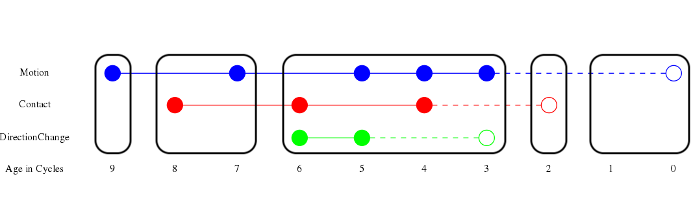
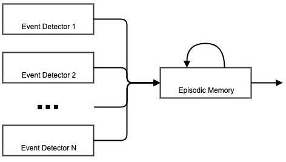

Event Memory
===

The perception of time is essential in recording accurate episodic memories, reasoning retrospectively about those memories, and using the resulting information to predict the future. If ARCADIA is to perform any of these tasks, it is necessary for it to be able to represent event structure discretely, hierarchically, and succinctly. Additionally, ARCADIA must be able to do all of this online from raw perceptual input. All of these factors contribute towards a model of event memory which is not only cognitively plausible from a psychological perspective, but more importantly one which supports efficient data representation and robust temporal inference.

## Constraints
Given an idea of why event perception is useful for a cognitive system, we can make some constraints on how we want it to operate. In general, we need event memory to be:

1. **Influenced by attention:**
While there is consensus that event segmentation happens automatically in people, there are still commonsense limitations to its effectiveness. As [this video](https://www.youtube.com/watch?v=IGQmdoK_ZfY) demonstrates, selective attention has the ability to prevent event segmentation for perceivable events that aren't being attended.
1. **Robust to perceptual noise:**
If we know anything about perception, we know that it doesn't always work the way we want or expect it to work. The same is true in ARCADIA. So if things go awry for a cycle, we want event memory to be able to smooth out these disturbances.
1. **Memory efficient:**
A simple solution to event segmentation would be to time-stamp everything that happens in ARCADIA. While this solution "works," it consumes much more memory than is necessary, and introduces dependencies on arbitrary timescales, all while failing to inform us about how event segmentation might work in people.
1. **Capable of temporal reasoning (before, after, during, while, etc):**
This is one of the biggest reasons we need event memory in the first place, and determines the overall shape of what should come out of event segmentation. Most notably, it requires that events are discrete, durational, and hierarchical.
1. **Constructed online:**
As of now, ARCADIA doesn't have any event traces pre-loaded into the system. So if we want any event traces, they need to be constructed on the fly.
1. **Modular:**
As with all components, it should be easy to turn event memory on and off within a model. Additionally, it should be somewhat parametrizable to suit a diverse set of needs.

## Representation
Thankfully, a representation which meets our demands already exists; the basic structure of event memory in ARCADIA is adapted from the temporal mental model theory, outlined in [Episodes, Events, and Models by Khemlani and colleagues](http://mentalmodels.princeton.edu/papers/2015events-episodes-models.pdf). Although our terminology may differ, the approach is roughly the same. In this representation we have a basic unit for events, as well as three levels of organization.




### Events
In ARCADIA, an event is represented as an interlingua element which specifies the presence of the event during the current cycle. In the diagram above, events are shown using filled in dots. Typically, an event element looks like this:
```Clojure
{:name "event"
 :arguments {:event-name <string>
             :objects <seq of objects>
             ...}
 :type "instance"
 :world nil}
 ```

Different types of events have different `:event-name` values, and different instances of the events have different `:objects`. The values of these two keys are the primary source of information for event memory to establish event equality.

### Event-Streams
Most of the time, events will last more than one cycle in ARCADIA. To capture the durational aspect of events, event memory "streams" events together by matching the events from the current cycle with the events from the previous cycle, interpreting the incoming events like data from an audio or video stream. We call the cycle-by-cycle chain of equal events event-streams for this reason. Event-streams are depicted as colored lines in the diagram above.

Importantly, event-streams have lifespans; if a matching event is not found in this many cycles, the event-stream is closed and the durational event is said to have ended. For instance, eight cycles ago there was no motion event detected. However, since there was an equal motion event seven cycles ago, the blue event-stream from before is extended to the present, and the gap in event detection is smoothed out. On the other hand, three cycles ago the DirectionChange event-stream was closed, since there hasn't been an observed event in two cycles. It is this behavior that allows for robustness to perceptual noise in event detection.

Every cycle, event memory broadcasts the current set of event-streams that are still regarded as active.

### Episodes
Depicted as black outlines in the figure above, episodes are periods of time in which the set of event-streams is unchanged. Nine cycles ago, there was only a motion event-stream. But one cycle later, a contact event was detected, starting a new episode. Similarly, the third episode ends three cycles ago, since the direction-change event-stream was closed.

Grouping of time into episodes allows for time compression in memory, vastly reducing the amount of information required to accurately represent the past.

### History
Finally, an event history is a stack of events. Whenever the set of event-streams that are active in event memory changes, the new event stream is pushed onto this stack. The entire history of events in ARCADIA is broadcast every cycle by event memory.

## Event Segmentation
Given the representation we just outlined, the basic process for event segmentation is simple: every cycle a set of components detect and report the presence of ongoing events, and event memory internally organizes all of the events into event-streams, episodes, and an event history. Every cycle event memory broadcasts the set of active event-streams, as well as an interlingua element containing the history of episodes since startup.

Therefore, event memory is configured to respond to any events that are already detected by ARCADIA. While this design makes using event memory modular and easily configurable, it relinquishes the burden of event detection onto other components. There already exist components for detecting basic visual events like motion, speed-change, direction-change, and contact. However, it is likely that this set of components will need to expand as their need grows.


