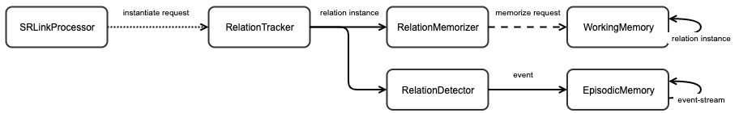

Relations (Potentially Outdated)
===
Relational reasoning is at the core of symbolic AI: in order for ARCADIA to be able to solve even basic problems, it needs to have a robust and compositional way to represent and manipulate relations. The library `arcadia.utility.relations`provides the basis for ARCADIA's approach to relational reasoning.

## Relation Definitions
A relation is a connection between one or more entities (including objects, relations, events, etc). In ARCADIA we use the constructor relation to specify these basic properties of the relation:

### Predicate Name
Necessarily, all relations require a string label. Stored in the key `:predicate-name`, the label should be something which clearly and concisely describes what the relation means. The current convention for naming relations is to use camel case, with the first letter in lowercase.

### Arity
Additionally, all relations need an `:arity`. For many relations this is a fixed number (the relation `>` is binary), but other relations (like `=`) can have a variable arity. Whenever variable arity is required, the arity of the relation should be set to a Clojure predicate which returns `nil` or `false` for values outside the accepted arity range, and any other value for acceptable arities. For example, the arity of the `=` relation could be set to the Clojure function
```Clojure
#(>= % 2)
```
which states that the arity is greater than or equal to 2.

### Ordered
Some relations impose an ordering on their arguments, while others don't. For instance, the relation `=(x, y)` is equivalent to `=(y, x)`, but `>(x, y)` is not equivalent to `>(y, x)`.
Formally, a binary relation is ordered if and only if it is not symmetric; we use the keyword `:ordered` to accommodate ordering constraints for relations that take more than two arguments.

### Unique
Some relations can be true of an object and itself, while others cannot; it makes sense to say that `=(x, x)` but not `>(x,x)`.
Formally, a relation is unique if and only if it is irreflexive (all of its arguments must be distinct for the relation to be true); we use the keyword `:unique` to accommodate relations that take more than two arguments.

### SR-Links
In logic programming, Horn clauses are used to define the semantics of relations. A Horn clause is a conditional statement where the antecedent consists of the relation's preconditions, and the consequent is an instance of the relation. For instance the Horn clause `between(x,y,z) ← (rightOf(x,y) ∧ rightOf(z,x))` states that `x` is between `y` and `z` if it is to the right of `y` and `z` is to the left of it. Note, though, that a single Horn clause will likely not be a complete definition; it's also true that `between(x,y,z) ← (above(x,y) ∧ above(z,x))`, or that `x` is between `y` and `z` if it is above `y` and `z` is above it. Consequently, a relation's complete (or working) definition is expressed as a set of Horn clauses.

Conveniently, SR-links can be used to implement Horn clauses for relation definitions in ARCADIA. The stimulus of an SR-link is a conjunctive set of interlingua elements; if all of the elements exist in accessible content, then the response is output. Similarly with Horn clauses, the presence of all of the preconditions of the clause triggers the instantiation of the clause's consequent. So, for relation definitions, the stimulus of an SR-link is a sequence of descriptors matching the relation's preconditions, and the response is a request to instantiate the relation. We'll go through this part in detail in the Walkthrough below.


## Relation Instances
All of the above properties define a relation; but in order to be useful, the relation needs to be instantiated over some objects. A relation instance is represented by an interlingua element with these `:arguments`:

| Keyword | Description |
|-|-|
| `:relation` | The relation being instantiated over (as defined above) |
| `:arguments` | A sequence of arguments for the relation: these can be interlingua representations of visual objects, background knowledge, or even other relation instances. |
| `:argument-descriptors` | A sequence of descriptors which label the corresponding interlingua in `:arguments`. |
| `:value` | A boolean value determining whether the relation is `true` or `false`. |
| `:context` | A string representing the world in which the relation holds. Usually, the context is set to the "real" world. In the case of hypothetical or counterfactual thinking, the context denotes a world distinct from reality. |
| `:justifications` | A sequence of interlingua elements which provide the basis for the relation's inference. |

Component Pipeline
Relation instances are used in ARCADIA in two major places: working memory and event memory. To get there, they follow this process:

1. Instantiation requests are generated from the relation's SR-links by the SRLinkProcessor.
1. The RelationTracker takes in these requests, and instantiates the relations. Note the dotted line here: some relations may require the focus of attention to be instantiated, but others may be instantiated without the additional use of attention.
1. Working Memory
        1. The RelationMemorizer generates requests to encode every relation instance in working memory if its value has changed.
        1. Finally, if given the focus of attention, WorkingMemory carries out the memorization request by storing the relation instance for later retrieval.
1. Event Memory
    1. The RelationDetector acknowledges the presence of relation instances in accessible content, and generates an event for them.
    1. Finally, EventMemory streams together the punctuative events into a temporally ordered and compressed representation.




## Walkthrough
To get a better idea of how all of these pieces fit together, let's go through an extended example of defining some relations, and seeing how they are processed into memory. First we need to declare the symbols we'll use to define the relations; this is necessary because while SR-links are part of the relation's definition, the SR-links themselves need a reference to the relation to create an instantiation request. For this walkthrough, we'll focus on the *rightOf* and *between* relations from above.
```Clojure
(declare rightOf-relation between-relation)
```

### Defining the *rightOf* Relation
Next, let's define the `rightOf` relation. It's a binary, ordered, and unique relation, characterized by the Horn clause `rightOf(a,b) ← >(a.x, b.x)`.
We can use the function relation to define it:
```Clojure
(def rightOf-relation
    (relation "rightOf" 2 true true
        (sr-link [(object-descriptor) (object-descriptor)]
                 (fn [obj1 obj2 content]
                    (when (> (-> obj1 :arguments :region :center :x)
                             (-> obj2 :arguments :region :center :x))
                        (instantiate rightOf-relation [obj1 obj2] [obj1 obj2]))))))
```
The first argument assigns the relation's `:predicate-name` to `"rightOf"`. The second restricts rightOf's `:arity` to two objects. The next two arguments specify that `rightOf` is both `:ordered` and `:unique`. Finally, the last argument is an SR-link which implements the Horn clause above. The relation function can take any number of these SR-links, but here we only need one. Let's break down the SR-link to better understand what's going on here:


The function `sr-link` creates a new SR-link. The first argument here is a vector of empty object-descriptors; this is the stimulus of the SR-link. Since the object-descriptors have no key-value constraints added, the SR-link will fire whenever any two object instances are present in accessible content.

```Clojure
(sr-link [(object-descriptor) (object-descriptor)]
```

Here we're creating the response function for the new SR-link. The function takes three arguments: the first two correspond to the objects found in accessible content, and the last is the complete set of accessible content itself.
```Clojure
(fn [obj1 obj2 content]
```

This predicate is what actually tests that `rightOf` is `true`. The x-coordinate of an object is stored in the :x slot of the `:center` of its `:region`. We're using the Clojure threading macro in order to avoid an excessive amount of parentheses.
```Clojure
(when (> (-> obj1 :arguments :region :center :x)
         (-> obj2 :arguments :region :center :x))
```

Finally, the utility function instantiate creates an action requesting for the instantiation of the `rightOf` relation we're defining over the two objects. The second argument specifies that the `:justifications` for the `rightOf` relation are the objects themselves. By default, instantiate sets the relation to `:value` to `true` and the `:context` to `"real"`. However, you can override these values with additional arguments. This action request is output by the SR-link when it is fired.

```Clojure
(instantiate rightOf-relation [obj1 obj2] [obj1 obj2]))))))
```

### Defining the *between* Relation
Now that we have the `rightOf` relation defined, we can create the composite relation `between`, defined by the Horn clause `between(x,y,z) ← (rightOf(x,y) ∧ rightOf(z,x))`.
```Clojure
(def between-relation
    (relation "between" 3 true true
        (sr-link [(instance-descriptor rightOf-relation :world "working-memory") (instance-descriptor rightOf-relation :world "working-memory")]
                 (fn [rightOf1 rightOf2 content]
                    (let [[x1 y] (:arguments (:arguments rightOf1))
                          [z x2] (:arguments (:arguments rightOf2))
                          [x1-d _] (:argument-descriptors (:arguments rightOf1))
                          [_ x2-d] (:argument-descriptors (:arguments rightOf2))]
                        (when (label-equals x1-d x2-d)
                            (instantiate between-relation [x1 y z] [rightOf1 rightOf2]))))
```
Let's break down this code as well: the call to the relation function creates a new relation with the `:predicate-name` `"between"` and an `:arity` of three objects that is both `:unique` and `:ordered`.

The call to `sr-link` creates a new SR-link defining the semantics of the `between` relation. This relation is a composite relation because it is defined in terms of other relations: namely `rightOf`. So, the stimulus of the SR-link is a sequence of two instances of the `rightOf` relation held in working memory.

```Clojure
(sr-link [(instance-descriptor rightOf-relation :world "working-memory") (instance-descriptor rightOf-relation :world "working-memory")]
```

The response function of the SR-link takes three arguments: two arguments for the instances of `rightOf` matched to the SR-link's stimulus, and one more argument for the set of accessible content.

```Clojure
(fn [rightOf1 rightOf2 content]
```

This piece of code extracts the object `:arguments` and `:argument-descriptors` from the `rightOf` relation instances using Clojure's destructuring syntax. Since we already know that `x1` is to the right of `y`, and that `z` is to the right of `x2`, all we need to check is that `x1` is the same object as `x2`. This is done by the call to the descriptor utility function `label-equals`, which makes sure that the label used to describe `x1` is the same as the label used to describe `x2`. We use this equality because although `x1` and `x2` might refer to the same object in the external world, they might be distinct interlingua produced at different points in time.

```Clojure
(let [[x1 y] (:arguments (:arguments rightOf1))
      [z x2] (:arguments (:arguments rightOf2))
      [x1-descr _] (:argument-descriptors (:arguments rightOf1))
      [_ x2-descr] (:argument-descriptors (:arguments rightOf2))]
    (when (label-equals x1-descr x2-descr)
```

Finally, the call to `instantiate` produces a request to instantiate the `between` relation over the objects `x1`, `y`, and `z`, using the two instances of `rightOf` as `:justifications`.

```Clojure
(instantiate between-relation [x1 y z] [rightOf1 rightOf2]))))
```

### Putting Relations To Use
Now that we have our two relations defined, we can see how they'd be utilized in ARCADIA. Assume that ARCADIA is set up to process an image with blue, red, and yellow objects, labeled B, R, and Y respectively. We can set up these object descriptors for labelling them:

```Clojure
(def b-descr (object-descriptor "B" :color "blue"))
(def r-descr (object-descriptor "R" :color "red"))
(def y-descr (object-descriptor "Y" :color "yellow"))
(def object-descriptors [b-descr r-descr y-descr])
```

At cycle 10, let's say these three objects are present in VSTM:
```Clojure
{:name "object"
 :arguments {:color "blue"
             :region {:center {:x 250 :y 100} ...}
             ...}
 :type "instance"
 :world "vstm"}

{:name "object"
 :arguments {:color "red"
             :region {:center {:x 50 :y 100} ...}
             ...}
 :type "instance"
 :world "vstm"}

{:name "object"
 :arguments {:color "yellow"
             :region {:center {:x 400 :y 100} ...}
             ...}
 :type "instance"
 :world "vstm"}
```

The SRLinkProcessor will match these objects to the descriptors in the stimulus of `rightOf`'s SR-link. This SR-link will be called nine times total since there are three options for each of the two stimuli, but only three of those calls result in an instantiation request:

```Clojure
{:name "instantiate"
    :arguments {:relation rightOf-relation
                :objects [{:name "object"
                           :arguments {:color "blue"
                                       :region {:center {:x 250 :y 100} ...}
                                       ...}
                           :type "instance"
                           :world "vstm"}
                          {:name "object"
                           :arguments {:color "red"
                                       :region {:center {:x 50 :y 100} ...}
                                       ...}
                           :type "instance"
                           :world "vstm"}
                :values [true]
                :context [real]
                :justifications [...]}
    :type "action"
    :world nil}

{:name "instantiate"
    :arguments {:relation rightOf-relation
                :objects [{:name "object"
                           :arguments {:color "yellow"
                                       :region {:center {:x 400 :y 100} ...}
                                       ...}
                           :type "instance"
                           :world "vstm"}
                          {:name "object"
                           :arguments {:color "red"
                                       :region {:center {:x 50 :y 100} ...}
                                       ...}
                           :type "instance"
                           :world "vstm"}
                :values [true]
                :context [real]
                :justifications [...]}
    :type "action"
    :world nil}

{:name "instantiate"
    :arguments {:relation rightOf-relation
                :objects [{:name "object"
                           :arguments {:color "yellow"
                                       :region {:center {:x 400 :y 100} ...}
                                       ...}
                           :type "instance"
                           :world "vstm"}
                          {:name "object"
                           :arguments {:color "blue"
                                       :region {:center {:x 250 :y 100} ...}
                                       ...}
                           :type "instance"
                           :world "vstm"}
                :values [true]
                :context [real]
                :justifications [...]}
    :type "action"
    :world nil}
```

On cycle 11, the `RelationTracker` executes each of these requests, matching all of their object arguments to their descriptor labels, and produces the following relation instances:

```Clojure
{:name "relation"
 :arguments {:relation rightOf-relation
             :argument-descriptors [b-descr r-descr]
             :arguments [...]
             :value true
             :context "real"
             ...
             :justifications [...]}
 :world nil
 :type "instance"}

{:name "relation"
 :arguments {:relation rightOf-relation
             :argument-descriptors [y-descr r-descr]
             :arguments [...]
             :value true
             :context "real"
             ...
             :justifications [...]}
 :world nil
 :type "instance"}

{:name "relation"
 :arguments {:relation rightOf-relation
             :argument-descriptors [y-descr b-descr]
             :arguments [...]
             :value true
             :context "real"
             ...
             :justifications [...]}
 :world nil
 :type "instance"}
```
Note that these relation instances have a `:world` of `nil`, meaning that they aren't yet in any memory system, and are therefore fleeting. On cycle 12, the `RelationMemorizer` creates these requests to update the status of the relations in working memory (the `:new` arguments are stand-ins for the actual relation instances above):

```Clojure
{:name "memory-update"
 :arguments {:old []
             :new [rightOf(B,R)]}
 :type "action"
 :world nil}

{:name "memory-update"
 :arguments {:old []
             :new [rightOf(Y,R)]}
 :type "action"
 :world nil}

{:name "memory-update"
 :arguments {:old []
             :new [rightOf(Y,B)]}
 :type "action"
 :world nil}
```
One by one from cycles 13-15, these `memory-update` requests get processed. Eventually, all of the relations now exist within working memory:

```Clojure
{:name "relation"
 :arguments {:relation rightOf-relation
             :argument-descriptors [b-descr r-descr]
             :arguments ...}
 :world "working-memory"
 :type "instance"}

{:name "relation"
 :arguments {:relation rightOf-relation
             :argument-descriptors [y-descr r-descr]
             :arguments ...}
 :world "working-memory"
 :type "instance"}

{:name "relation"
 :arguments {:relation rightOf-relation
             :argument-descriptors [y-descr b-descr]
             :arguments ...}
 :world "working-memory"
 :type "instance"}
```
At this point, the relations are ready for use by other relations. On cycle 16, the `SRLinkProcessor` feeds these relation instances into the `between` relation's SR-link. Like with `rightOf` the SR-link is called a total of nine times, but only one call results in an instantiation request (like above, we use "rightOf(x,y)" in the `:justifications` field as a stand-in for the actual relation instances):

```Clojure
{:name "instantiate"
    :arguments {:relation rightOf-relation
                :objects [{:name "object"
                           :arguments {:color "blue" ...}
                           :type "instance"
                           :world "vstm"}
                          {:name "object"
                           :arguments {:color "red" ...}
                           :type "instance"
                           :world "vstm"}
                          {:name "object"
                           :arguments {:color "yellow" ...}
                           :type "instance"
                           :world "vstm"}
                :values [true]
                :context [real]
                :justifications [rightOf(B, R) rightOf(Y, B)]}
    :type "action"
    :world nil}
```

From here, the `between` relation instance follows the same trajectory as the `rightOf` instances; it is instantiated by the `RelationTracker`, updated by the `RelationMemorizer`, and finally put into `WorkingMemory`.
